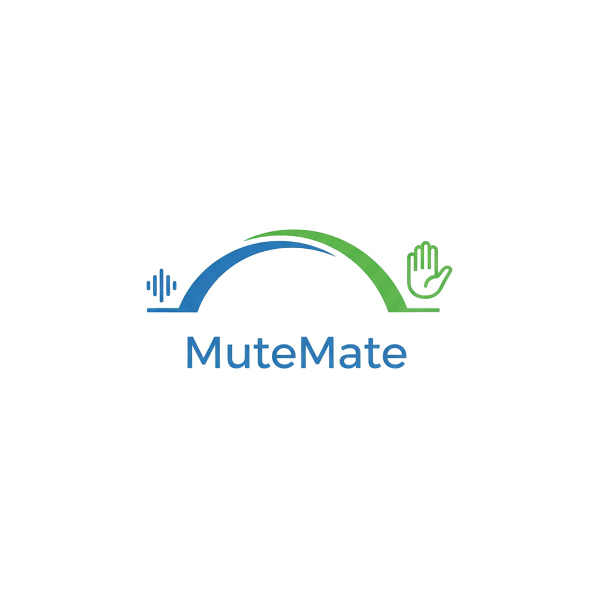
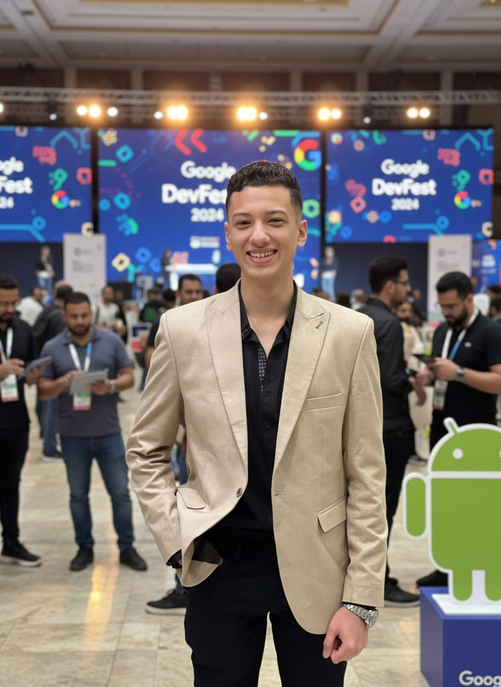
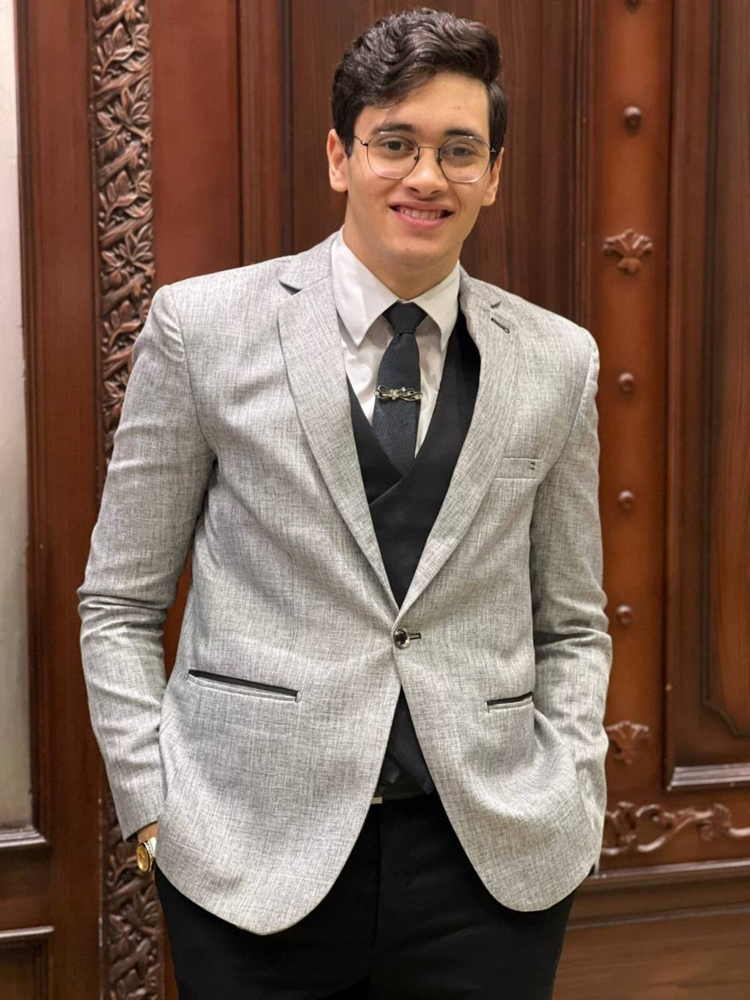
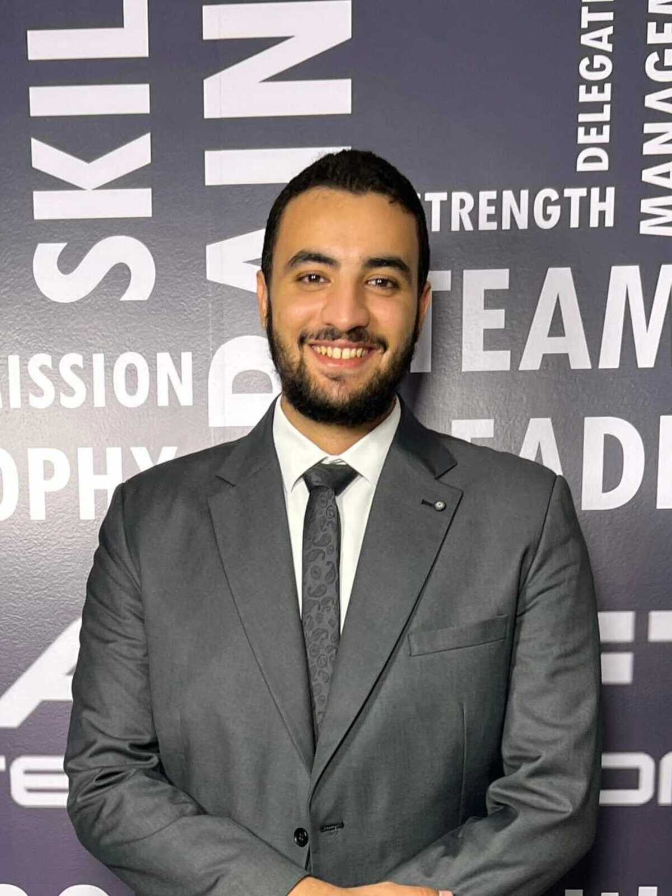
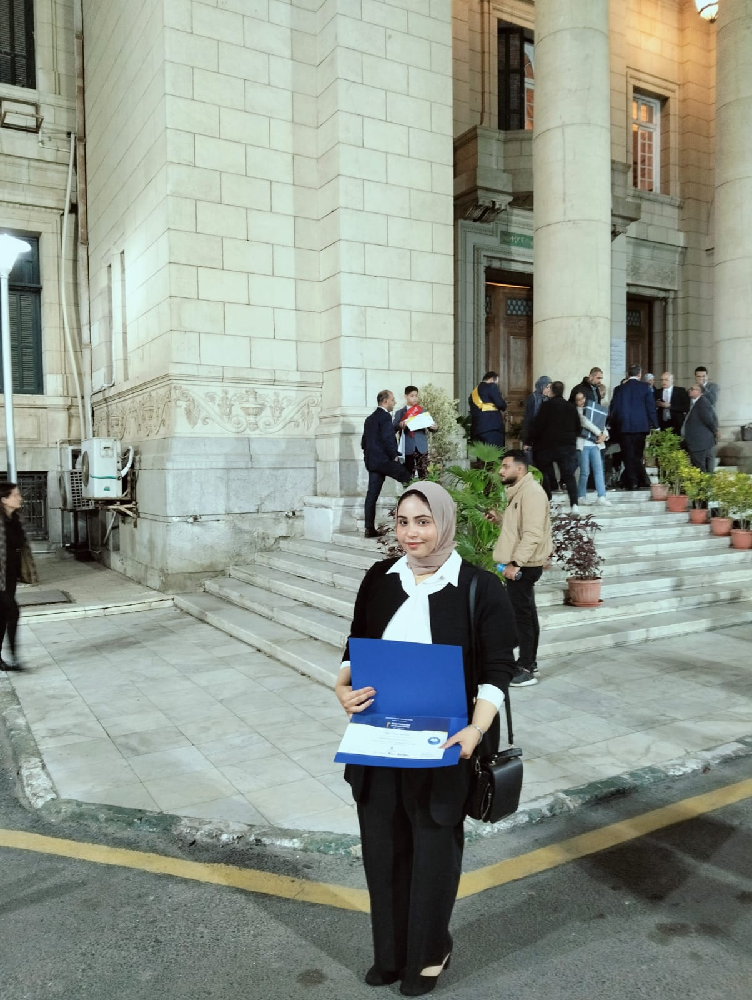
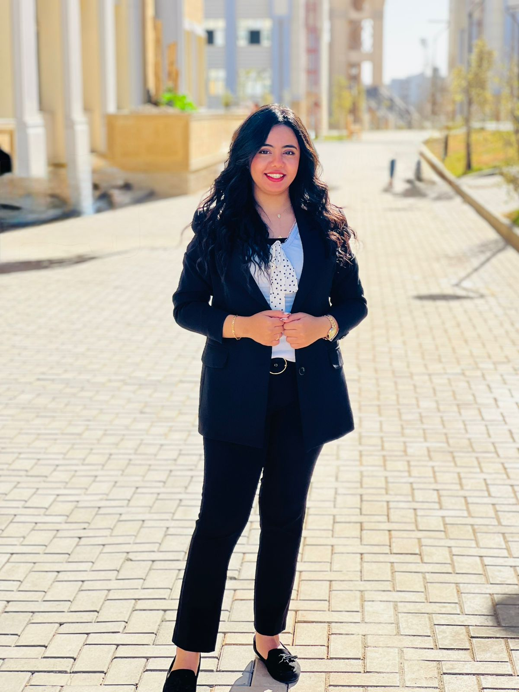
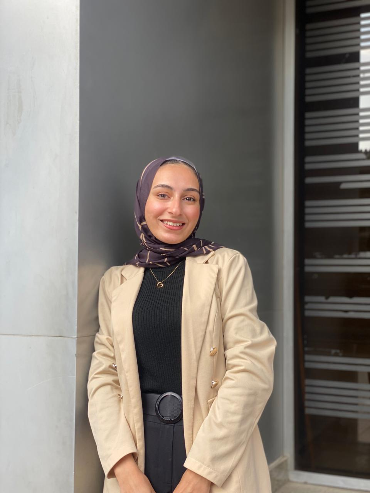

  
  

<h1 align="center">MuteMate</h1>
MuteMate is a graduation project developed by students of Helwan National University – BIDT Program (Class of 2026).  
It is dedicated to supporting the deaf and mute community in Egypt, aiming to break communication barriers and create equal opportunities for inclusion.
 
---
## 👥 Team Members  

  <table>
    <tr>
      <td align="center">
         
        <b>Polla Joseph Labeeb Aziz</b>
      </td>
      <td align="center">
         
        <b>Abdelrahman Mohamed Anwer</b>
      </td>
      <td align="center">
         
        <b>Assem Ayman Mohamed Ibrahim</b>
      </td>
      <td align="center">
         
        <b>Hager Galal Ahmed Galal</b>
      </td>
      <td align="center">
         
        <b>Marllen Sery Saleh Nakhla</b>
      </td>
      <td align="center">
         
        <b>Omnia Hussein Saad Mahmoud</b>
      </td>
      <td align="center">
         
        <b>Shahd Ragab Saad Youssef</b>
      </td>
    </tr>
  </table>

---

## 🎯 Project Goals  
- Faster **inclusion** and **social participation**.  
- Remove **discrimination** against the deaf and mute community.  
- Provide **digital solutions** that empower communication.  
- Promote **equal opportunities** in education, work, and daily life.  

---

## 🌍 Why MuteMate?  
In Egypt, many members of the deaf and mute community face challenges in expressing themselves and interacting with society.  
**MuteMate** seeks to bridge this gap by offering innovative tools and technologies that ensure their voices are heard and respected.  

---

## 👩‍🎓 About the Project  
- **University:** Helwan National University  
- **Program:** BIDT (Business Information & Digital Transformation)  
- **Class:** 2026  

---

## 🚀 Vision  
To build a more inclusive society where everyone, regardless of ability, can communicate, learn, and participate equally.  

---

## 📌 Next Steps  
- Add **features overview** (what MuteMate provides).  
- Add **tech stack** (Flutter, Django, APIs, etc.).  
- Add **installation guide** (if open-source).  
- Add **contributors** (team members).  

---
